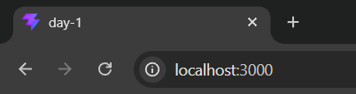
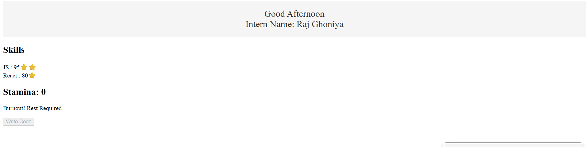

# 📑 Daily Task Submission Report
**MERN Stack Internship | Prelytix Private Limited**

| Field | Details |
| :--- | :--- |
| **Student Name** | Raj Ghoniya |
| **Internship ID** | PRL-MERN-2026-XXXX |
| **Date** | 2026-05-12 |
| **Course Day** | Day 1 |
| **GitHub Repo** | https://github.com/raj2911-tech/Summer-Internship- |

---

## 🎯 Daily Objective

> Today, I learned React fundamentals including component structure, project organization, and React hooks with setState. I implemented prop passing between components and built interactive UI elements with state management to understand data flow in React applications.

---

## 🛠️ Implementation & Changes (Self-Documentation)

### 1. New Features / Logic Implemented
- **What:** Created dynamic greeting component and skill badge system.
- **How:** Built Header component that displays time-based greetings, SkillList that maps skill array to SkillBadge components, and Stamina component with click-based state reduction.
- **Why:** To practice component composition, prop drilling, and state management in React.

### 2. UI/UX Enhancements
- Implemented responsive skill badges with star icon display for mastered skills (level >= 90).
- Added visual feedback for stamina system with disabled button when stamina reaches 0.
- Styled components with CSS for better UI presentation and readability.

### 3. Database / Backend Updates
- N/A (Frontend only - Day 1 focus on React basics)

---

## 💻 Code Snippet: My Primary Contribution

```jsx
// Stamina Component - State Management with Conditional Rendering
import React, { useState } from "react";

const Stamina = () => {
  const [stamina, setStamina] = useState(100);
  const [clicks, setClicks] = useState(0);

  const decreaseStamina = () => {
    const newClicks = clicks + 1;
    setClicks(newClicks);

    if (stamina <= 0) {
      setStamina(0);
      return;
    }

    if (newClicks % 5 === 0) {
      if (stamina - 15 <= 0) setStamina(0);
      else setStamina(stamina - 15);
      return;
    }

    setStamina(stamina - 2);
  };

  if (stamina === 0) {
    return (
      <div>
        <h2>Stamina: {stamina}</h2>
        <p>Burnout! Rest Required</p>
        <button onClick={decreaseStamina} disabled>
          Write Code
        </button>
      </div>
    );
  }else{
     return (
    <div>
      <h2>Stamina: {stamina}</h2>
      <button onClick={decreaseStamina}>Write Code</button>
    </div>
  );
  }
};

export default Stamina;
```

---

## 📸 Screenshots / Proof of Work

> **App Running on Port 3000:**
> 

> **Skill Badge with Star Icon and Stamina System:**
> 
---

## 🛑 Challenges Faced & Solutions

- **Problem:** State was decreasing by 15 on first click instead of after 5 clicks.
- **Solution:** Used `newClicks` variable and checked `(newClicks % 5) === 0` condition before state update.

- **Problem:** Multiple `setStamina` calls were conflicting.
- **Solution:** Used `return` statements to exit function early and prevent additional state updates.

- **Problem:** Stamina went negative when decreasing.
- **Solution:** Added Conditions to prevent stamina from going below 0.

---

## 💡 Key Learnings

- **React Hooks (useState):** Learned how to manage component state and trigger re-renders on state changes.
- **Props Drilling:** Passed data from parent (App) to child components (SkillList, SkillBadge).
- **Conditional Rendering:** Used ternary operators and logical AND to render different UI based on state.
- **Array Methods:** Used `.map()` to convert array of objects into React components.
- **State Management Logic:** Implemented click-based stamina reduction with modulo operator.

---

## 🔗 Live Preview

- **Local Dev Server:** http://localhost:3000
- **Note:** Run `npm install` and `npm run dev` to start the development server.

---

**Signature:**  
*Raj Ghoniya*  
*Date: 2026-05-12*
