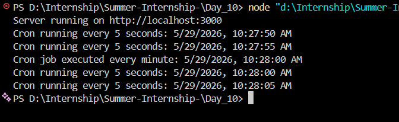

# 📑 Daily Task Submission Report  
**MERN Stack Internship | Prelytix Private Limited**

| Field | Details |
| :--- | :--- |
| **Student Name** | Raj Ghoniya |
| **Internship ID** | PRL-MERN-2026-XXXX |
| **Date** | 2026-05-26 |
| **Course Day** | Day 10 |
| **GitHub Repo** | https://github.com/raj2911-tech/Summer-Internship- |

---

## 🎯 Daily Objective

> Today, I learned how to use **node-cron** to schedule automated tasks in a Node.js and Express.js application. The focus was on running jobs at specific intervals, including every minute, every day at 9 AM, and every 5 seconds.

---

## 🛠️ Implementation & Changes (Self-Documentation)

### 1. New Features / Logic Implemented
- **What:** Added cron-based scheduled jobs to the Express server.
- **How:** Used the `node-cron` package to define time-based tasks with cron expressions.
- **Why:** To understand how automation works in backend applications without manual intervention.

### 2. Server Setup
- Created an Express server running on port `3000`.
- Added a basic home route (`/`) to verify the server is active.
- Integrated `node-cron` for scheduled job execution.

### 3. Features Implemented
- **Every minute job:** Logs a message once per minute.
- **Daily 9 AM job:** Logs a message every day at 9:00 AM.
- **Every 5 seconds job:** Logs a message every 5 seconds for quick interval testing.

### 4. Key Learnings
- How to install and use `node-cron` in a Node.js project.
- How cron expressions control task scheduling.
- How to schedule multiple jobs in a single Express application.
- How to use second-level cron timing with `*/5 * * * * *`.

---

## 💻 Code Snippet: My Primary Contribution

````js
// filepath: server.js
const express = require("express");
const cron = require("node-cron");

const app = express();
const PORT = 3000;

// Route
app.get("/", (req, res) => {
  res.send("Server is running...");
});

// Every minute
cron.schedule("* * * * *", () => {
  console.log("Cron job executed every minute:", new Date().toLocaleString());
});

// Every day at 9 AM
cron.schedule("0 9 * * *", () => {
  console.log("Daily 9 AM cron job executed:", new Date().toLocaleString());
});

// Every 5 seconds
cron.schedule("*/5 * * * * *", () => {
  console.log("Cron running every 5 seconds:", new Date().toLocaleString());
});

app.listen(PORT, () => {
  console.log(Server running on http://localhost:${PORT});
});

````

---

## Output Image



---

## 💡 Key Learnings

### Cron Scheduling in Node.js

- **node-cron Package:** Used for scheduling repeated tasks.
- **Cron Expressions:** Learned how different patterns control timing.
- **Automation:** Jobs can run automatically in the background.
- **Testing Intervals:** Used 5-second scheduling to verify cron behavior quickly.
---

## 🔗 Live Preview

- **Local Server:** http://localhost:3000
- **Git Repository:** https://github.com/raj2911-tech/Summer-Internship-

---

**Signature:**  
*Raj Ghoniya*  
*Date: 2026-05-26*