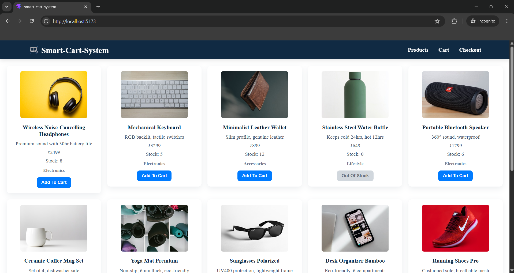
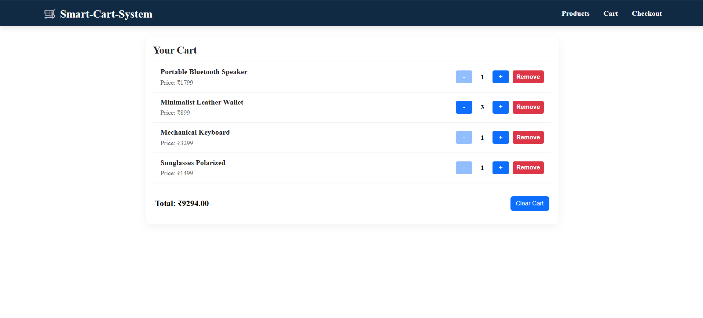

# 📑 Final Task Submission Report  
**MERN Stack Internship | Prelytix Private Limited**

| Field | Details |
| :--- | :--- |
| **Student Name** | Raj Ghoniya |
| **Internship ID** | PRL-MERN-2026-XXXX |
| **Date** | 2026-06-09 |
| **GitHub Repo** | https://github.com/raj2911-tech/Summer-Internship- |

---

# Smart Cart System

A simple React-based e-commerce cart application for browsing products, adding items to the cart, updating quantities, and checking out.

## Features

- Product listing page
- Add-to-cart functionality
- Cart item quantity control
- Quantity limits:
  - Minimum: 1
  - Maximum: 10
- Clear entire cart
- Cart data persistence using `localStorage`
- Checkout page
- Discount calculation utility

## Tech Stack

- React
- React Router
- Context API
- JavaScript
- CSS

## Project Structure

```text
src/
  App.jsx
  index.css
  main.jsx
  components/
    Cartitem.css
    Cartitem.jsx
    Nav.css
    Nav.jsx
    ProductCard.css
    ProductCard.jsx
  context/
    CartContext.jsx
  data/
    products.json
  pages/
    Cart.jsx
    Checkout.jsx
    Products.jsx
  utils/
    discountCalculator.js
```

## How It Works

### Products Page
- Loads product data from `src/data/products.json`
- Displays products using `ProductCard`
- Adds items to the cart through `CartContext`

### Cart System
- Cart state is managed globally with `CartContext`
- Cart is saved in `localStorage`
- If the same product is added again, the quantity increases
- Quantity cannot go above `10`
- Quantity cannot go below `1`

### Cart Page
- Displays all added products
- Shows the total price
- Allows:
  - increasing quantity
  - decreasing quantity
  - removing an item
  - clearing the cart

### Checkout Page
- Handles the final order flow
- Uses cart data from context


## ScreenShots





## Challenges Faced

- **CartContext state management:** Handling add, increment, decrement, remove, and clear actions in a single global context was challenging.
- **Discount calculation:** Calculating discounts correctly based on different conditions was difficult.
- **Rendering:** Rendering all items on the page using components was tricky.

## Known Issues

- No backend integration
- Product images depend on the Unsplash; offline use will show broken images
- No user authentication

## Future Improvements

- Backend integration
- Use a database instead of a JSON file
- Add authentication using JWT

## Author

*Raj Ghoniya*  